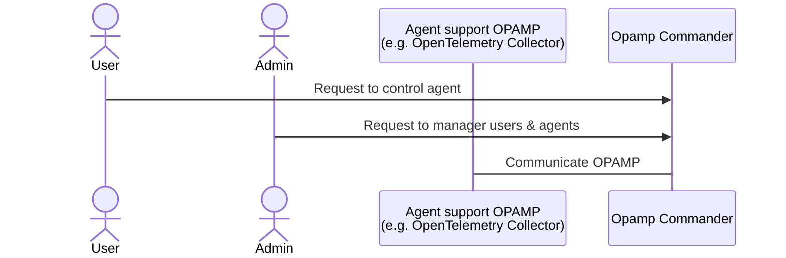

# Opamp Commander

## What is Opamp Commander?
- [OPAMP (Open Agent Management Protocol)](https://opentelemetry.io/docs/specs/opamp/) is defined by opentelemetry.
- But, it is hard to find an implementation of OPAMP server.:
  - In [OPAMP github page](https://github.com/open-telemetry/opamp-spec), there is only [BindPlane OP](https://observiq.com/) as a Agent Management Platforms

- But, it is hard to use and test OPAMP.
- Opamp Commander provides a simple way to use and test OPAMP.

## How to work

- Opamp Commander is a server that supports OPAMP.
- Agent is a observability agent that supports OPAMP.
- User is a platform user who wants to control agents.
- Admin is a platform admin who wants to manage users & agents.

